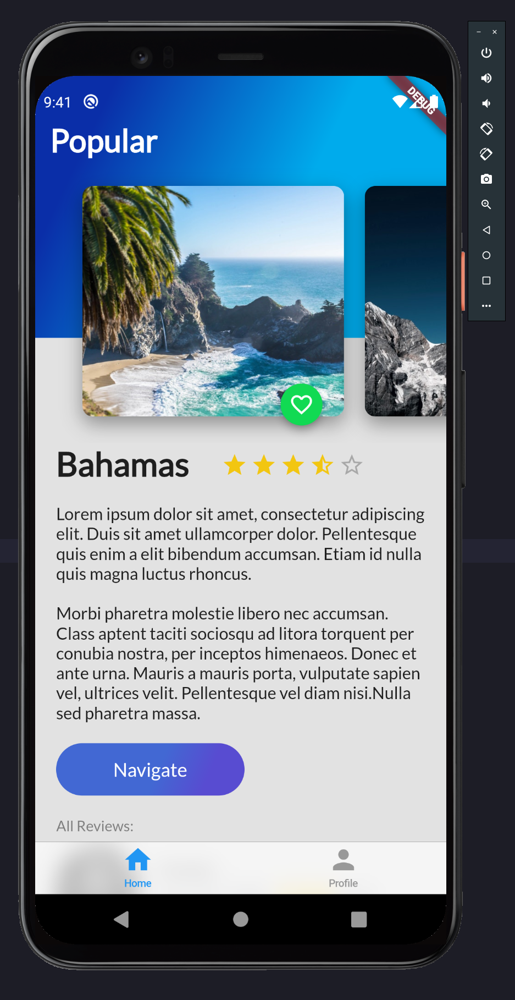
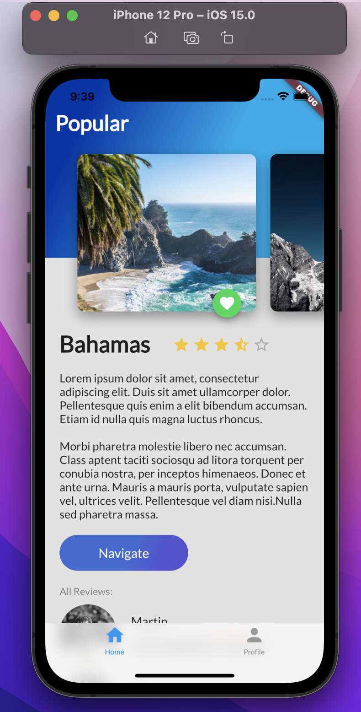
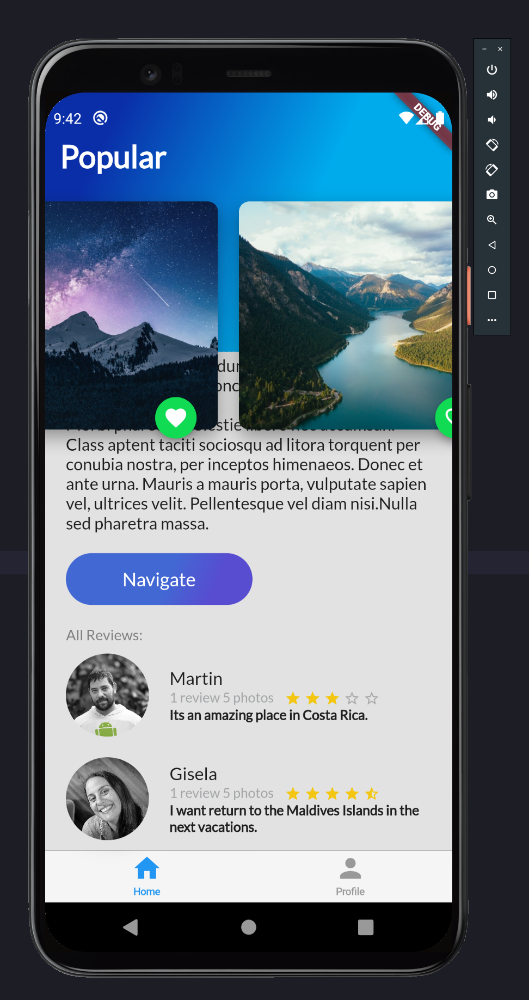
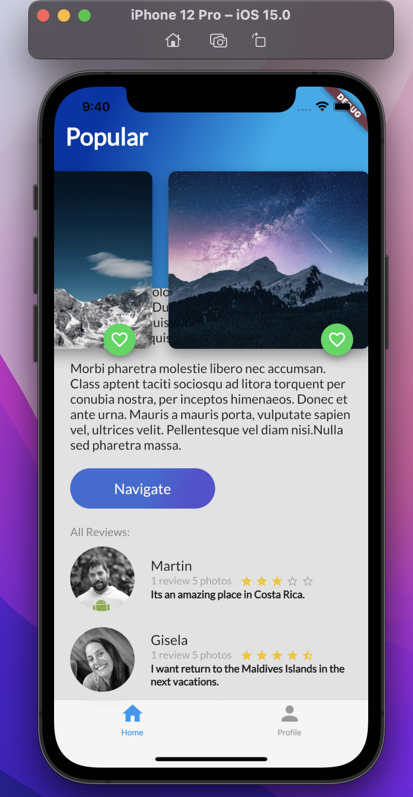
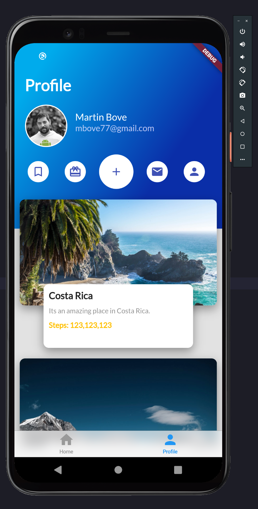
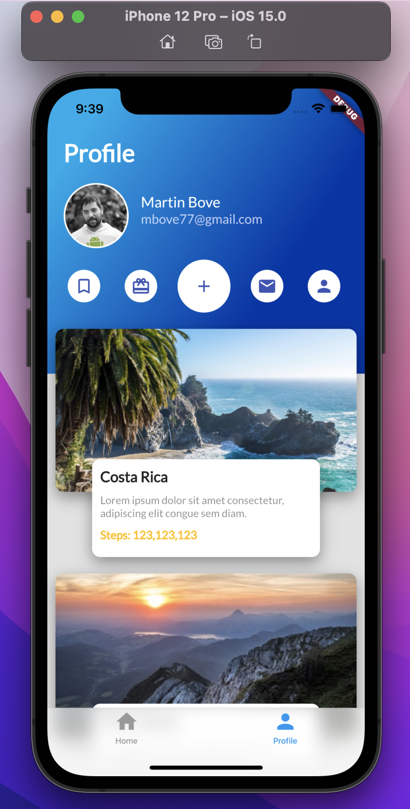

# Trips Flutter App
Es una aplicación con fines académicos, para explorar el desarrollo de interfaces con Flutter.

## Tecnologías bajo el capot
Esta app está construida con el lenguaje de programación Dart y el SDK de Flutter.
La misma aplicación está compilada tanto en Android como en iOS como se puede ver en las capturas.

| Android  | iOS  |
| --- | --- |
|  |  |
|  |  |
|  |  |
